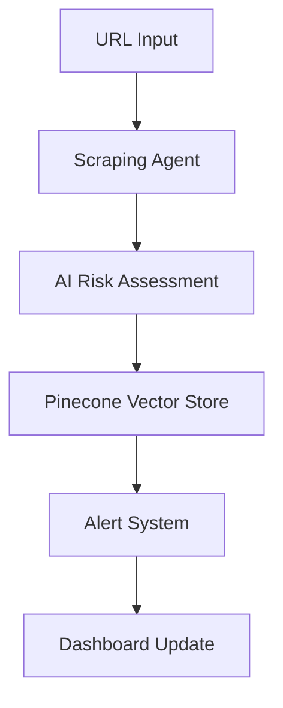

# FraudGuard 🛡️

[](https://opensource.org/licenses/MIT)
[](https://www.python.org/downloads/)
[](https://fastapi.tiangolo.com/)
[](https://developer.mozilla.org/en-US/docs/Web/JavaScript)

> **AI-Powered Fraud Detection Platform**  
> A unified system for the Securities and Exchange Board of India (SEBI) to detect and prevent investment fraud across social media and official financial sources.


## 📋 Table of Contents

- [Problem Statement](#-problem-statement)
- [Solution Overview](#-solution-overview)
- [Features](#-features)
- [Technology Stack](#-technology-stack)
- [Architecture](#-architecture)
- [Getting Started](#-getting-started)
- [API Documentation](#-api-documentation)
- [Usage Examples](#-usage-examples)
- [Roadmap](#-roadmap)
- [Contributing](#-contributing)
- [License](#-license)

## 🛑 Problem Statement

Financial fraudsters increasingly exploit public platforms and official sources, orchestrating sophisticated scams that ultimately harm retail investors and undermine market trust.

### Core Challenges

- **Pump-and-Dump Schemes**: Coordinated buying signals across social media designed to manipulate stock prices
- **Fake Corporate News**: Misleading company announcements and fake documentation influencing investor decisions
- **Fraudulent Advisors**: Unregistered or impersonated investment advisors/brokers targeting investors
- **Misleading Stock Tips**: Dissemination of baseless recommendations via group chats, luring users into risky investments

## ✅ Solution Overview

FraudGuard is a comprehensive client-server application that empowers SEBI investigators and analysts to:

- 🔍 Scrape and analyze social media, messaging groups, and official exchanges
- 🤖 Detect and categorize fraudulent content using advanced AI
- 📊 Access risk assessments and actionable insights in real time
- 🚨 Receive automated alerts for high-risk content


### Main Components

- **High-performance Backend API**: Built with FastAPI for scalable scraping and AI-powered fraud analysis
- **Intuitive Frontend Dashboard**: Responsive, Bootstrap-powered dashboard for URL submission and instant feedback
- **AI-Powered Analysis**: Gemini AI model for risk assessment and content categorization
- **Vector Database**: Pinecone for semantic search and pattern detection

## 🌟 Features

- **Multi-Platform Scraping**: Reddit, YouTube, Twitter/X, LinkedIn, Discord, Telegram, NSE/BSE/SEBI
- **AI Risk Analysis**: Advanced fraud detection with dynamic risk scoring
- **Semantic Search**: Vector-based similarity detection across platforms
- **Workflow Automation**: n8n integration for orchestrated fraud detection
- **Real-time Dashboard**: Instant analysis results with intuitive UI
- **RESTful API**: Comprehensive endpoints for all platform integrations

## 🛠 Technology Stack

| Component | Technology |
|-----------|------------|
| **Backend** | Python, FastAPI, Uvicorn, PRAW, Requests |
| **Frontend** | HTML5, CSS3, JavaScript, Bootstrap 5 |
| **Scraping** | Playwright, BeautifulSoup4, Official APIs |
| **Orchestration** | n8n (workflow automation) |
| **Vector Database** | Pinecone |
| **AI Model** | Gemini (risk analysis, content categorization) |

## 🏗 Architecture

### Scraper Technology Breakdown

- **Reddit**: PRAW API with BeautifulSoup4 fallback
- **YouTube**: Google API Client + youtube-transcript-api
- **Twitter/X, LinkedIn, Discord**: Requests + BeautifulSoup4
- **Telegram**: Automated bots for investment scam detection
- **NSE/BSE/SEBI**: Regulatory announcements scraping

### AI-Powered Risk Analysis

- Text, links, audio, and media analysis using Gemini AI
- Detection of misleading stock tips, deepfake content, fake advisors
- Dynamic risk scoring with investigation summaries

### Multi-Agent Orchestration with n8n



## 🚀 Getting Started

### Prerequisites

- Python 3.8+
- Node.js (for n8n orchestration)
- Pinecone API key
- Gemini API key

### Installation

1. **Clone the Repository**
   ```bash
   git clone https://github.com/your-username/fraudguard.git
   cd fraudguard
   ```

2. **Backend Setup**
   ```bash
   cd server
   pip install -r requirements.txt
   ```

3. **Environment Configuration**
   ```bash
   cp .env.example .env
   # Edit .env with your API keys
   ```

4. **Run the Backend**
   ```bash
   uvicorn analyzer_service:app --reload --host 127.0.0.1 --port 8000
   ```

5. **Launch the Frontend**
   ```bash
   cd ../frontend
   python -m http.server 3000
   # Or simply open index.html in your browser
   ```

### Environment Variables

```bash
# .env file
GEMINI_API_KEY=your_gemini_api_key
PINECONE_API_KEY=your_pinecone_api_key
PINECONE_ENVIRONMENT=your_pinecone_environment
REDDIT_CLIENT_ID=your_reddit_client_id
REDDIT_CLIENT_SECRET=your_reddit_client_secret
YOUTUBE_API_KEY=your_youtube_api_key
```

## 📡 API Documentation

### Base URL: `http://127.0.0.1:8000`

| Method | Endpoint | Description |
|--------|----------|-------------|
| `POST` | `/reddit/extract` | Scrape Reddit URL, raw data only |
| `POST` | `/youtube/extract` | Scrape YouTube URL, metadata + transcript |
| `POST` | `/twitter/extract` | Scrape Twitter/X URL, textual content |
| `POST` | `/linkedin/extract` | Scrape LinkedIn URL, visible post data |
| `POST` | `/discord/extract` | Scrape Discord URL, visible group/chat content |
| `POST` | `/exchange/extract` | Scrape BSE/NSE URL, announcement text |
| `GET` | `/analyze-url` | **Primary endpoint**: Analyze any URL with Gemini AI |

### API Usage Example

```bash
# Analyze a suspicious URL
curl -X GET "http://127.0.0.1:8000/analyze-url" \
     -H "Content-Type: application/json" \
     -d '{"url": "https://reddit.com/r/investing/comments/example"}'
```

### Response Format

```json
{
  "platform": "reddit",
  "title": "Amazing Stock Tip - 1000% Guaranteed Returns!",
  "risk_level": "HIGH",
  "risk_score": 0.95,
  "summary": "Contains multiple fraud indicators including guaranteed returns claims and pump-and-dump language",
  "content": "...",
  "timestamp": "2024-01-15T10:30:00Z"
}
```

## 💻 Usage Examples

### Frontend Dashboard

1. Open the frontend dashboard
2. Paste any supported URL in the input field
3. Click "Analyze" for instant fraud detection
4. View results in the live results table

### API Integration

```python
import requests

# Analyze suspicious content
response = requests.get(
    "http://127.0.0.1:8000/analyze-url",
    params={"url": "https://example.com/suspicious-post"}
)

result = response.json()
if result["risk_level"] == "HIGH":
    print(f"⚠️  High risk detected: {result['summary']}")
```

## 🗺 Roadmap

### Phase 1 (Current)
- [x] Multi-platform scraping engine
- [x] AI-powered risk analysis
- [x] Basic frontend dashboard
- [x] RESTful API endpoints

### Phase 2 (Next Quarter)
- [ ] Role-based access control
- [ ] Real-time WhatsApp & Telegram integration
- [ ] Advanced deepfake detection
- [ ] Push notification system

### Phase 3 (Future)
- [ ] Full frontend-backend integration
- [ ] Market sentiment analysis
- [ ] Multi-language support
- [ ] Mobile application

## 🤝 Contributing

We welcome contributions from the community! Please see our [Contributing Guidelines](CONTRIBUTING.md) for details.

### Development Setup

1. Fork the repository
2. Create a feature branch: `git checkout -b feature/amazing-feature`
3. Commit changes: `git commit -m 'Add amazing feature'`
4. Push to branch: `git push origin feature/amazing-feature`
5. Open a Pull Request

### Code Style

- Follow PEP 8 for Python code
- Use ESLint for JavaScript
- Write comprehensive tests
- Update documentation

## 📄 License

This project is licensed under the MIT License - see the [LICENSE](LICENSE) file for details.

## 🙏 Acknowledgments

- Securities and Exchange Board of India (SEBI) for regulatory guidance
- Open source community for amazing tools and libraries
- Contributors and testers who help improve FraudGuard

## 📞 Support

- **Issues**: [GitHub Issues](https://github.com/your-username/fraudguard/issues)
- **Discussions**: [GitHub Discussions](https://github.com/your-username/fraudguard/discussions)
- **Email**: support@fraudguard.dev

---

<div align="center">
  <strong>Protect investors. Strengthen market integrity. Stay ahead of fraud with FraudGuard.</strong>
  <br><br>
  
  
</div>
